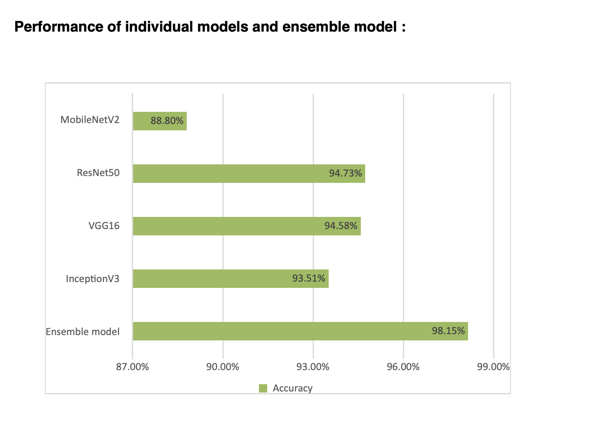

# Medical Image Classification Using Ensemble Learning

Validating gastrointestinal diseases from endoscopic images using deep learning models and weighted ensemble techniques.

---

## Table of Contents
- [Overview](#overview)
- [Business Problem](#business-problem)
- [Objectives](#objectives)
- [Dataset](#dataset)
- [Tools and Technologies](#tools-and-technologies)
- [Methodology](#methodology)
- [Models Used](#models-used)
- [Ensemble Learning Approach](#ensemble-learning-approach)
- [Results](#results)
- [Key Findings](#key-findings)
- [How to Use This Project](#how-to-use-this-project)
- [Future Work](#future-work)
- [Author and Contact](#author-and-contact)

---

## Overview

This project applies ensemble learning techniques to classify gastrointestinal diseases from endoscopic images using the Kvasir v2 dataset. Four pre-trained deep learning models were fine-tuned and combined using weighted averaging to achieve superior classification accuracy compared to individual models.

---

## Business Problem

Manual examination of gastrointestinal endoscopic images is time-consuming and prone to human error. Individual deep learning models face challenges such as:
- Overfitting to specific training data patterns
- Inconsistent performance across different disease types
- Limited generalization to new image variations
- Sensitivity to lighting and image quality issues

These limitations can lead to delayed diagnosis and impact patient treatment outcomes.

---

## Objectives

- Implement data augmentation techniques to improve model generalization
- Fine-tune multiple pre-trained CNN architectures for medical image classification
- Apply ensemble learning to combine predictions from multiple models
- Achieve higher classification accuracy than any individual model
- Ensure consistent performance across all eight disease classes

---

## Dataset

The project uses the Kvasir v2 dataset containing gastrointestinal endoscopic images across eight classes:

| Class | Description |
|-------|-------------|
| Dyed-Lifted-Polyps | Polyps highlighted with dye during endoscopy |
| Dyed-Resection-Margins | Margins marked during resection procedures |
| Esophagitis | Inflammation of the esophagus |
| Normal-Cecum | Healthy cecum images |
| Normal-Pylorus | Healthy pylorus images |
| Normal-Z-Line | Healthy gastroesophageal junction |
| Polyps | Abnormal tissue growths |
| Ulcerative-Colitis | Inflammatory bowel disease |

---

## Tools and Technologies

- Python 3.x
- TensorFlow and Keras
- Pre-trained CNN models (InceptionV3, VGG16, ResNet50, MobileNetV2)
- Kaggle platform with GPU T4 accelerators
- Data augmentation libraries
- Jupyter Notebook

---

## Methodology

1. **Data Augmentation**: Applied rotation (±10 degrees) and zoom (1.1-1.6x) transformations to increase dataset diversity and prevent overfitting
2. **Transfer Learning**: Initialized four pre-trained models with ImageNet weights
3. **Model Fine-Tuning**: Replaced top layers with custom dense layers, batch normalization, and dropout for the specific classification task
4. **Individual Training**: Trained each model separately on the augmented dataset
5. **Ensemble Creation**: Combined predictions using weighted averaging based on individual model accuracies
6. **Evaluation**: Assessed performance using accuracy metrics and confusion matrices

---

## Models Used

### InceptionV3
- 48 convolutional layers with inception modules
- Efficient feature extraction through multi-scale convolutions
- Accuracy: 93.51%

### VGG16
- 13 convolutional layers with simple, consistent architecture
- Strong feature learning through deep stacked convolutions
- Accuracy: 94.58%

### ResNet50
- 50 convolutional layers with skip connections
- Addresses vanishing gradient problem in deep networks
- Accuracy: 94.73%

### MobileNetV2
- 17 convolutional layers optimized for efficiency
- Uses depthwise separable convolutions
- Accuracy: 88.80%

---

## Ensemble Learning Approach

The weighted average ensemble technique assigns different weights to each model based on individual performance. The ensemble prediction is calculated as:

Ensemble Prediction = (w1 × prediction1) + (w2 × prediction2) + (w3 × prediction3) + (w4 × prediction4)

Where weight for each model is:

w(i) = accuracy(i) / (accuracy1 + accuracy2 + accuracy3 + accuracy4)

This approach ensures that higher-performing models contribute more to the final prediction, leading to improved overall accuracy.

---

## Results

### Individual Model Performance

| Model | Accuracy |
|-------|----------|
| MobileNetV2 | 88.80% |
| InceptionV3 | 93.51% |
| VGG16 | 94.58% |
| ResNet50 | 94.73% |
| **Ensemble Model** | **98.15%** |

The ensemble model outperformed all individual models, demonstrating the effectiveness of combining multiple architectures for medical image classification.

### Model Performance Comparison

The bar chart illustrates the accuracy comparison between individual models and the ensemble approach. The ensemble model achieved 98.15% accuracy, significantly outperforming the best individual model (ResNet50 at 94.73%) by 3.42 percentage points.

---

## Key Findings

- The ensemble model achieved 98.15% accuracy, outperforming all individual models by at least 3.42 percentage points
- ResNet50 demonstrated the highest individual accuracy at 94.73%, followed by VGG16 at 94.58%
- MobileNetV2 showed lower accuracy (88.80%) but contributed valuable predictions for specific disease classes
- Ensemble learning successfully addressed individual model weaknesses in classifying difficult cases such as esophagitis and normal z-line
- Data augmentation techniques significantly improved model generalization across all architectures
- The weighted averaging approach effectively leveraged the strengths of each model while minimizing their individual limitations

---

## How to Use This Project

1. Clone the repository:
git clone https://github.com/vasiq8/Medical-Image-Analysis—Ensemble-Learning.git

2. Install required dependencies:
pip install tensorflow keras numpy pandas matplotlib scikit-learn

3. Download the Kvasir v2 dataset from Kaggle and place it in the data directory

4. Run the preprocessing notebook to prepare the data

5. Train individual models using the training scripts

6. Evaluate ensemble performance using the evaluation notebook

---

## Future Work

- Expand the dataset to include more diverse endoscopic image types and additional disease classes
- Experiment with other ensemble techniques such as stacking or boosting
- Implement attention mechanisms to identify critical regions in medical images
- Deploy the ensemble model as a web application for real-time disease classification
- Conduct clinical validation studies to assess real-world diagnostic performance
- Explore explainable AI techniques to provide interpretable predictions for medical professionals

---

## Author and Contact

**Vasiq**  
Email: vasiq.8@gmail.com  
Phone: 8385898989  

Academic Project - B.Tech Data Science and AI  
ICFAI University Hyderabad  
Supervisor: Dr. Priyanka Parimi

